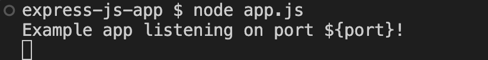
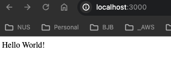

# Create an Express JS App

* ```npm init -y ```
* ```npm install express``` ==> this will install express
* Create a app.js file and add below code

```js

const express = require('express');
const app = express();
const port = 3000;
app.get('/', (req, res) => res.send('Hello World!'));
app.listen(port, () => console.log('Example app listening on port ${port}!'));

```

* run command: ```node app.js```





* Dockerize node JS app

```
# Specify the base image
FROM node:14

# Set the working directory inside the container
WORKDIR /app

# Copy package.json and package-lock.json to the working directory
COPY package*.json ./

# Install app dependencies
RUN npm install

# Copy the rest of the app source code to the working directory
COPY . .

# Expose a port (if your app listens on a specific port)
EXPOSE 3000

# Define the command to run your app
CMD [ "npm", "start" ]

```

* Test the build by:
    * ```docker build -t node-js:latest .```
    * ```docker run -p 3000:3000 node-js:latest ```

* Next step is to configure this in Jenkinsfile so that it could be built in the pipeline and pushed to the docker hub registry