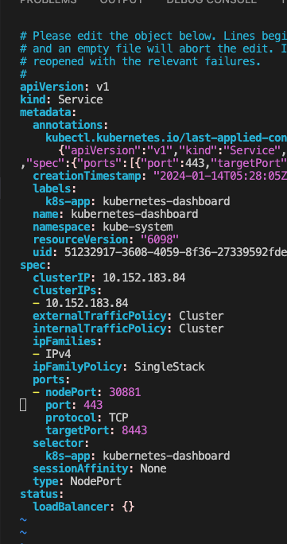

### Microk8s server set up

* Reference Link to Install Microk8s on AWS Ec 2: https://alabekir1975.medium.com/installing-microk8s-on-aws-on-ubuntu20-04-server-e362091fb5ee
* Microk8s installation guide: https://ubuntu.com/tutorials/install-a-local-kubernetes-with-microk8s#1-overview

### Some instructions from my end:
* Setting up a micro k8s server
* Spin up a ec2 instance with 2 core and 2 or 4 Gig Ram
* SSH to the instance and install Microk8s
* To know the user name for different instance type: https://docs.aws.amazon.com/AWSEC2/latest/UserGuide/managing-users.html
* I am using ubunut server, so user name for me will be: ubunutu
* Change the permission: ``` chmod 400 "microk8s-server-keypair.pem" ```
* SSH: ```ssh -i "microk8s-server-keypair.pem" ubuntu@ec2-54-165-228-69.compute-1.amazonaws.com```
* Install Micro k8s: ```sudo snap install microk8s --classic```
* You may need to configure your firewall to allow pod-to-pod and pod-to-internet communication. As mentioned here: https://ubuntu.com/tutorials/install-a-local-kubernetes-with-microk8s#2-deploying-microk8s

```
sudo ufw allow in on cni0 && sudo ufw allow out on cni0
sudo ufw default allow routed

```

* addons which I have enabled:

```
ubuntu@ip-172-31-56-118:~$ sudo microk8s status
microk8s is running
high-availability: no
  datastore master nodes: 127.0.0.1:19001
  datastore standby nodes: none
addons:
  enabled:
    dashboard            # (core) The Kubernetes dashboard
    dns                  # (core) CoreDNS
    ha-cluster           # (core) Configure high availability on the current node
    helm                 # (core) Helm - the package manager for Kubernetes
    helm3                # (core) Helm 3 - the package manager for Kubernetes
    hostpath-storage     # (core) Storage class; allocates storage from host directory
    ingress              # (core) Ingress controller for external access
    metrics-server       # (core) K8s Metrics Server for API access to service metrics
    registry             # (core) Private image registry exposed on localhost:32000
    storage              # (core) Alias to hostpath-storage add-on, deprecated
  disabled:
    cert-manager         # (core) Cloud native certificate management
    cis-hardening        # (core) Apply CIS K8s hardening
    community            # (core) The community addons repository
    gpu                  # (core) Automatic enablement of Nvidia CUDA
    host-access          # (core) Allow Pods connecting to Host services smoothly
    kube-ovn             # (core) An advanced network fabric for Kubernetes
    mayastor             # (core) OpenEBS MayaStor
    metallb              # (core) Loadbalancer for your Kubernetes cluster
    minio                # (core) MinIO object storage
    observability        # (core) A lightweight observability stack for logs, traces and metrics
    prometheus           # (core) Prometheus operator for monitoring and logging
    rbac                 # (core) Role-Based Access Control for authorisation
    rook-ceph            # (core) Distributed Ceph storage using Rook

```
* to get all the resources: ```microk8s kubectl get all --all-namespaces```
* check the dashboard view 
* to get the dashboard token: 

```
token=$(microk8s kubectl -n kube-system get secret | grep default-token | cut -d " " -f1)
microk8s kubectl -n kube-system describe secret $token

```

* To expose the Dashboard to the outside world we need to change the dashboard service file from Cluster IP to Node Port. 

```
NAMESPACE            NAME                                TYPE        CLUSTER-IP      EXTERNAL-IP   PORT(S)                  AGE
kube-system          service/kubernetes-dashboard        NodePort    10.152.183.84   <none>        443:30881/TCP            8d

```
* To do this you need run ```microk8s kubectl edit service/kubernetes-dashboard  -n kube-system```
* edit the spec.type as "NodePort" (See the third last line in screen shot)
* 
* This will expose the dashboard to 443:30881/TCP . in my case port 30881. Be sure to use https file navigating from the browser.

* However there is also another way of exposing an internal cluster ip service to out side world that is via Ingress and Ingress Controller. lets see how in the next page.


