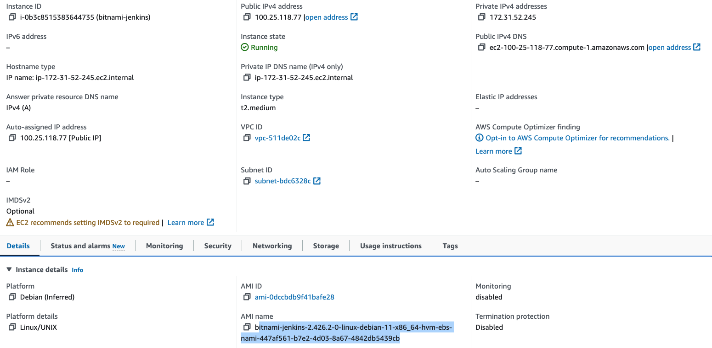

### 1. Set up Jenkins server on AWS

* I am using Bitnami Jenkins here. You have a resuable AMI which bitnami provides and you can directly use it. 
* Product Link: https://aws.amazon.com/marketplace/pp/prodview-ywvglhsjiahkk
* Recommended server size is t3a.small which gives you 2 Core and 2 gig of RAM.
* Creating an instance is out of scope but make sure you set it up in your default VPC and the security group you are using allows TCP traffic. If you do not know it yet, I would recommend go through some decent tutorial on how to spin up an EC2 instance in AWS. There are plenty of resources online for that.
* Notice the AMI I am using in below screen shot: ```bitnami-jenkins-2.426.2-0-linux-debian-11-x86_64-hvm-ebs-nami-447af561-b7e2-4d03-8a67-4842db5439cb```

* 

* Once you have the instance up and running navigate to the public url of your server and it should serve the jenkins login page.
* Username is : ```user``` but password has to be retrieved. Instructions on how to retrieve the password is listed here: https://docs.bitnami.com/aws/faq/get-started/find-credentials/

* After login go to settings and add below plugins:
    * git
    * pipeline
    * docker
    * Note: When you search for these plugins you will see lot of plugins with similar title. Just install the plugins with the simple titles as above.

* Restart the Jenkins

### How to SSH to this bitnami Jenkins Instance

* Username is: bitnami
* and identity key is the same which you created when you spinned up the instance.
* More details check here: https://docs.bitnami.com/aws/faq/get-started/connect-ssh/

### Install Docker
* Use this Link to install Docker on Bitnami Debian: https://docs.bitnami.com/aws/apps/jenkins/configuration/install-docker-debian/

* Below commands needs to be executed to install Docker. They are exactly the same command what you see in above link.

```sh

    2  sudo apt-get update
    3  sudo apt-get install -y     apt-transport-https     ca-certificates     curl     gnupg2     software-properties-common
    4  curl -fsSL https://download.docker.com/linux/debian/gpg | sudo apt-key add -
    5  sudo add-apt-repository     "deb [arch=amd64] https://download.docker.com/linux/debian \
    6      $(lsb_release -cs) \
    7      stable"
    8  sudo apt-get update
    9  sudo apt-get install -y docker-ce docker-ce-cli containerd.io
   10  getent
   11  getent group
   12  sudo usermod -aG docker bitnami
   13  docker run hello-world
   15  exit  ==> Exit the shell and login in back in
   16  docker run hello-world

```

* There are still some additional step which needs to be done to make docker commands run on this instance
    * ```sudo usermod -aG docker jenkins```
    * If after the above command you still get docker.sock permission error then below command should solve the issue. But below command is not a safe thing to do. So, do not do this in prod set up.
    * ```sudo chmod 777 /var/run/docker.sock```
    * Check the error and solution here: https://www.edureka.co/community/7764/trying-docker-jenkins-pipeline-facing-jenkins-pipeline-socket

### Install Semgrep for SAST scan
* https://semgrep.dev/docs/getting-started/quickstart/

```
# install
python3 -m pip install semgrep

# confirm
semgrep --version

```

*
    

