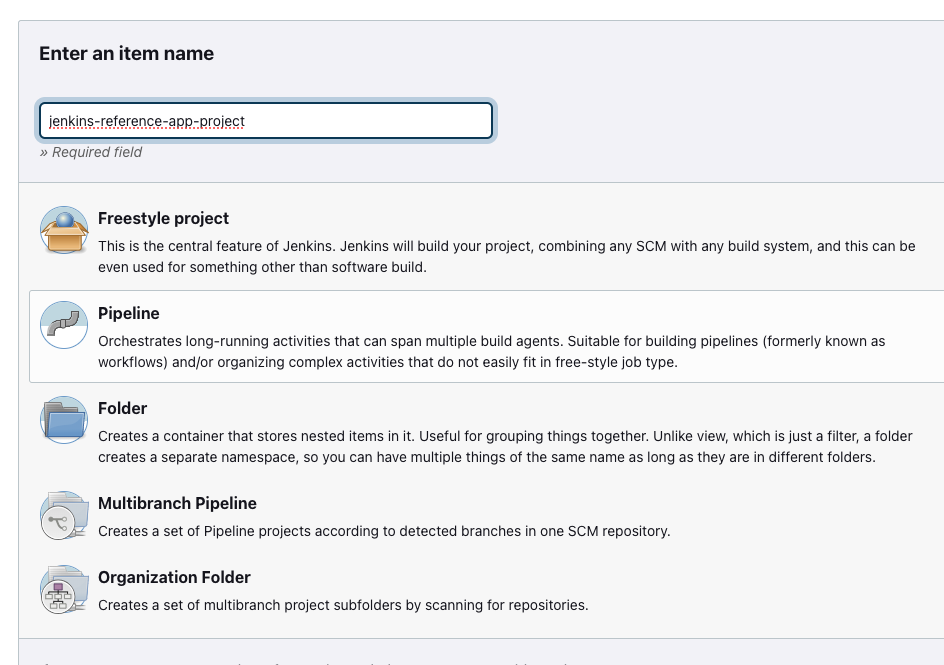
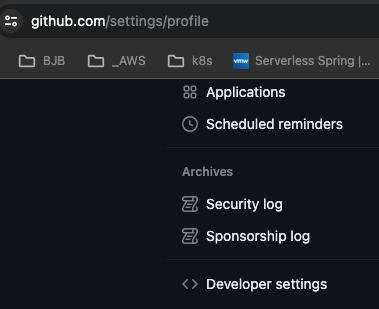
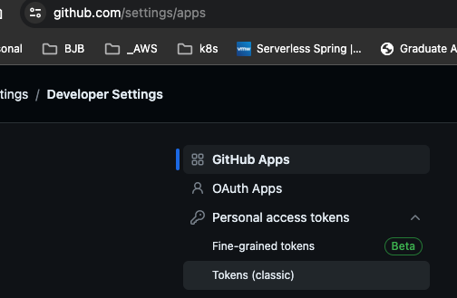
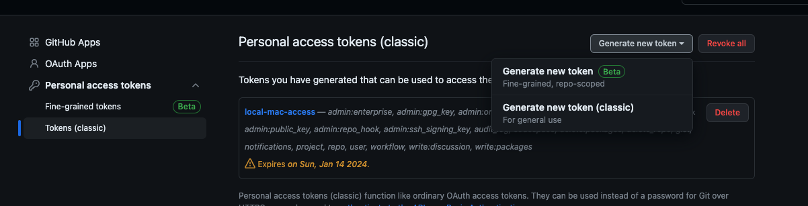
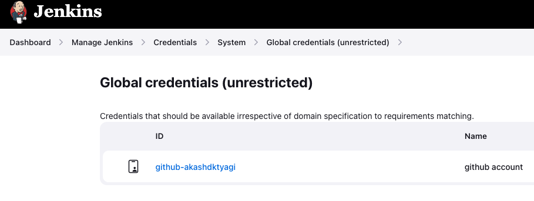
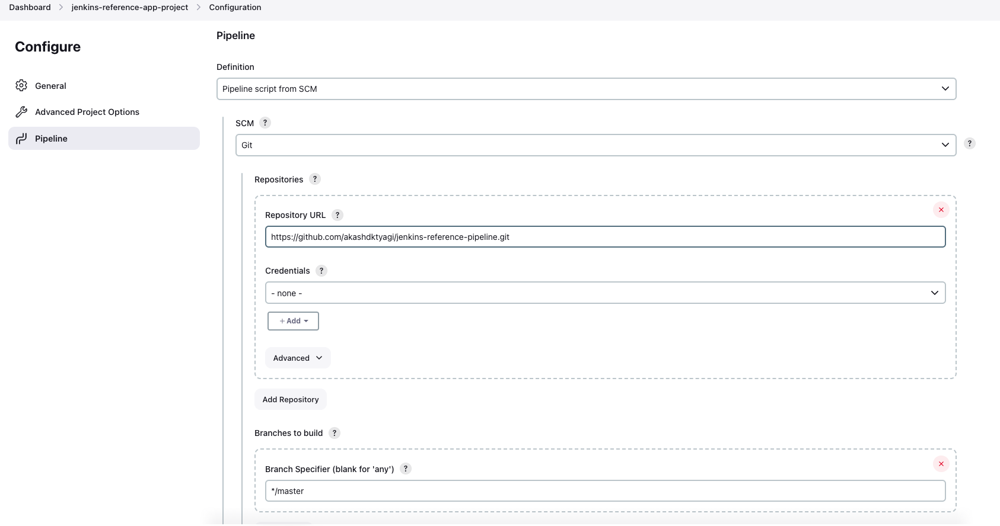
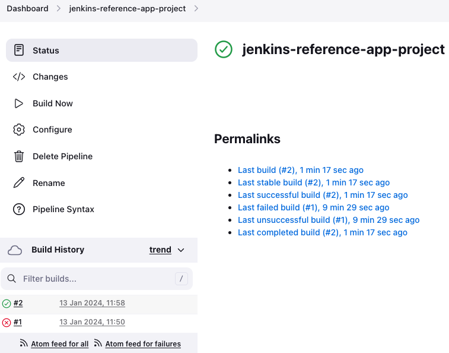
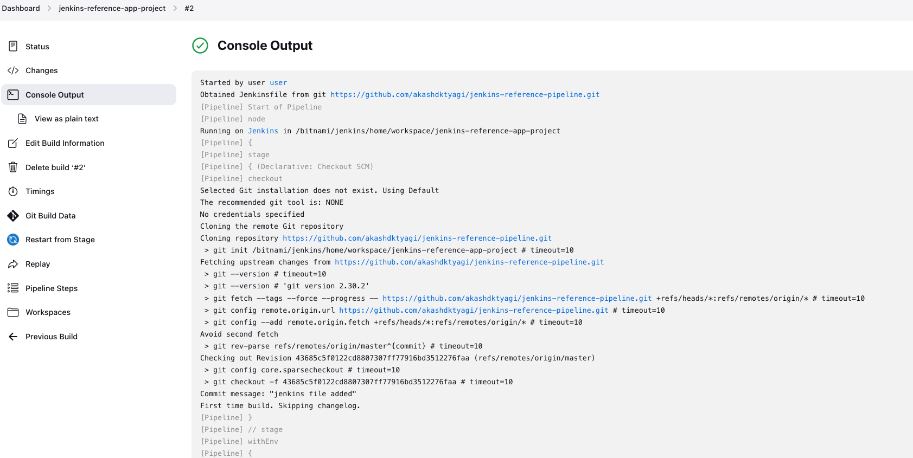

### 2. Jenkins Create project

* Click new item and select pipeline project
* 
* Below credentials will only be needed if your project is private if it is public then no need for credentials. Skip to the configure project.
* Create a github token from github account and add the token in jenkins credentials manager.



* Add github credentials in Jenkins Credentials manager: 


* Configure the project as per below screenshot:


* Project expect a Jenkinsfile in the root directory of the project. Lets add that with below code snippet and check in the code. After checkin the code run the pipeline.

```
pipeline {
    agent any
    stages {
        stage('Build') {
            steps {
                sh 'echo "Hello World Build stage."'
                sh 'docker info'
            }
        }
        stage('Test') {
            steps {
                sh 'echo "Hello World Test stage."'
            }
        }
        stage('Deploy') {
            steps {
                sh 'echo "Hello World Deploy stage."'
            }
        }
    }
}

```



* Click on the Console Output



